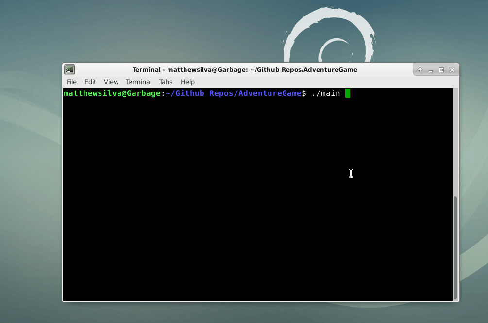
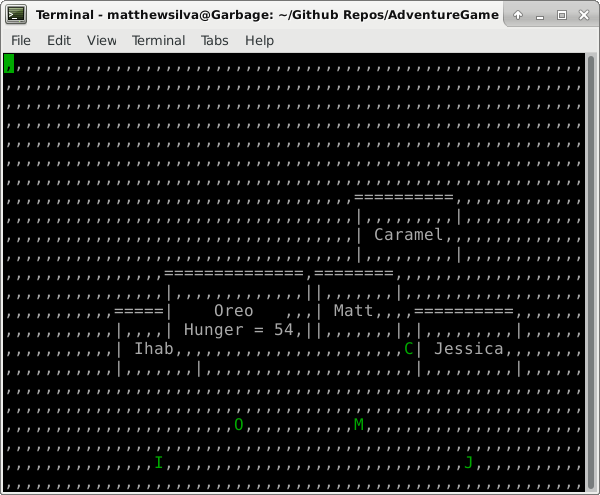

# AdventureGame

A short example of character bounce, user movement, wall collisions, hunger degradation, and gameplay finalizing

-------------------------------------------------------------------------------------------------

A screnshot of gameplay

-------------------------------------------------------------------------------------------------

The game end screen

# Game Description:

AdventureGame is a simple demo of using the ncurses text display library to render a physics-based 2D platformer

# Installation (On Debian Stretch)

Installation just requires the virtual package "libncurses-dev"

	sudo apt install libncurses-dev
	
# Compiling

Compile main.cc using the following command
	
	g++ main.cc -lpthread -lncurses -o main
	
		
	
# Running

Running the code is as easy as running the executable you created. No arguments are necessary
	
	e.g.
	
	./main

#Playing
	
The user can control the "Matt" character using the WASD keys

End the game by pressing Escape
